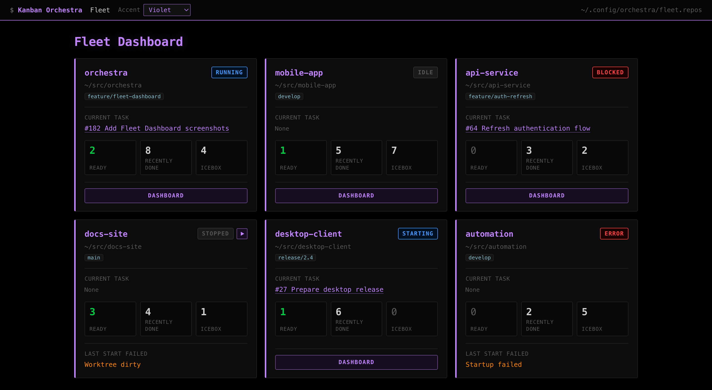
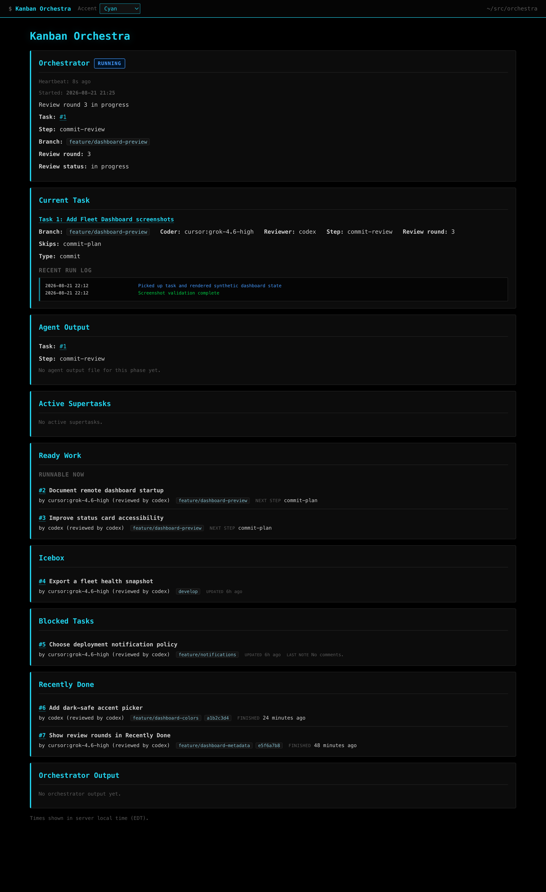
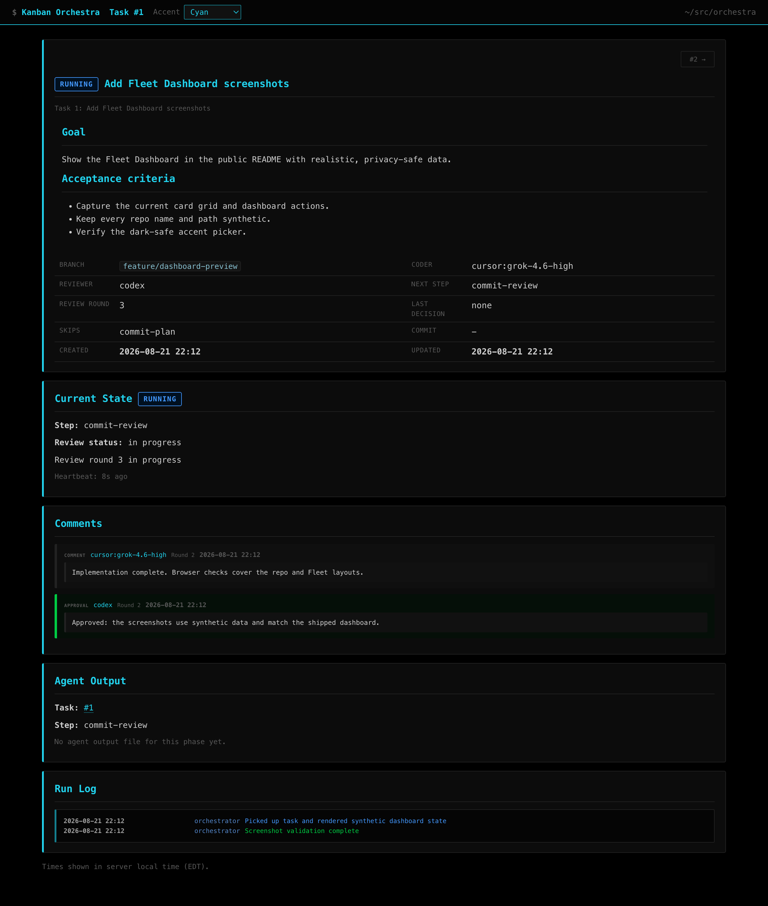

# Orchestra

**One developer. One machine. A durable queue of coherent coding tickets.**

Orchestra coordinates the AI coding CLIs already installed on your machine. You
describe a piece of work once; Orchestra queues it, assigns agents to plan,
build, and review it, records the complete decision trail, and lands the
approved commit in your repo.

The machine remains the execution boundary. Git state, task history, agent
processes, credentials, and builds stay local. Tailscale makes the dashboards
available over tailnet-only HTTPS, so the same single-developer workflow works
from your desk, phone, or iPad without turning Orchestra into a hosted or
multi-user service.

<p align="center">
  
</p>

## The Point

Orchestra is designed for a single developer who wants to queue several
well-specified tickets and let local coding agents carry each one through a
coherent lifecycle. It is deliberately not a team issue tracker, distributed
worker system, or cloud build service.

For a normal commit task, Orchestra manages two feedback loops:

```text
ticket
  ↓
[ plan  ⇄  plan review ]
  ↓
commit-make  ⇄  [ commit review ]
  ↓
commit-make (finalize)  →  one landed commit
```

Brackets mark optional steps. A plan rejection returns to the planner; a commit
rejection returns to the same sticky coder. Approval continues downward, and
the actual git commit is not created until finalization.

- **Plan** and **plan review** are optional. Normal tasks skip planning by
  default; enable it when implementation deserves a reviewed approach before
  files change.
- **Commit-make** is required. The assigned coder builds or reworks the staged
  candidate and records validation evidence and the proposed commit message.
- **Commit review** is optional. When enabled, a separate reviewer inspects the
  staged diff. Rejections return to the same coder; approval returns to that
  coder for finalization.
- Reviewer infrastructure failures are not content rejections. Orchestra
  retries them without spending a review round, then blocks with the candidate
  preserved if the reviewer remains unavailable.

Each repo instance processes one task at a time, so agents cannot trample one
another in the same worktree. Fleet can run several repo instances side by side
on the same machine.

## How You Use It

The primary interface is your AI agent's **Kanban skill**, not a CLI you need
to operate by hand. In a work repo, ask your agent for what you want:

> "Using the Kanban skill, queue a task to fix the broken pagination query."

The skill turns that request into a durable Markdown ticket, lets you refine it
in `none`, and moves it to `ready` when it is coherent. The orchestrator then
owns normal workflow transitions. You step back in when a task needs a product
decision, missing context, or an explicit recovery choice.

The task database and durable comments keep the ticket, plan, validation,
review decisions, run history, and landed commit tied together. A coding-agent
session can end without losing the workflow.

### Task Types

The normal unit is a **commit task**: one coherent ticket, one eventual landed
commit. Orchestra also supports narrower advanced workflows:

- **Pull request tasks** manage a PR and its review without landing commits.
- **Other tasks** perform non-standard or operational work and leave durable
  completion evidence instead of requiring a commit or PR.
- **Supertasks** let a planner derive and sequence the commit-sized child tasks
  needed for a larger outcome; the supertask itself never lands a commit.

## One Machine, From Anywhere

Remote use preserves the same operating model. Orchestra and every coding CLI
continue to run on one developer-controlled machine. Tailscale only extends the
control surface:

- dashboard startup brings localhost online first
- it then makes a best-effort attempt to publish an exact Tailscale Serve HTTPS
  mapping
- existing mappings are reused and unrelated Serve routes are left untouched
- Tailscale absence or failure never blocks localhost
- Funnel is not enabled; remote dashboards remain tailnet-only

Use the exact URL printed by `ko-get-update`, `ko-fleet status`, or dashboard
startup. Orchestra prefers the live Tailscale URL when an exact mapping exists
and otherwise falls back to localhost. Dashboard hostnames and ports are
runtime state, not configuration to hard-code.

From a remote Codex or Claude session that reaches the machine, you can queue a
ticket in plain language. From the Fleet Dashboard, you can watch every repo,
open its dashboard, and start an eligible stopped instance. The result is the
same single-developer workflow whether you are sitting at the Mac or checking
in from an iPhone or iPad.

## Dashboards

### Fleet Dashboard

The Fleet Dashboard turns every repo in your private fleet config into a status
card. Each card shows its path, branch, runtime state, current task, Ready,
Recently Done, and Icebox counts, plus its Dashboard action and any known
startup failure. An eligible stopped repo gets a play action that uses the same
validation and startup path as `ko-fleet start <repo>`.

Repo dashboards open in a new tab so the Fleet view stays put. A Fleet view
reached through Tailscale links cards to their exact Tailscale mappings; a
local Fleet view links cards to localhost.

### Repo Dashboard

The repo dashboard exposes the active task, queues, recent completions,
review-round count, durable comments, and run history. The task-detail view
keeps the goal, acceptance criteria, orchestration state, review evidence, and
logs together.

When a live Fleet Dashboard is discoverable, repo overview and task-detail
pages show a compact **Fleet Dashboard** action in the top bar. It uses the
preferred Tailscale-or-local URL and returns to Fleet in the same tab.

<table>
  <tr>
    <th width="50%">Repo overview</th>
    <th width="50%">Task detail</th>
  </tr>
  <tr>
    <td></td>
    <td></td>
  </tr>
</table>

Both dashboard types include a dark-safe **Accent** picker. The Fleet Dashboard
and each repo persist their own tint by dashboard identity, so a new dashboard
does not inherit another dashboard's color. Localhost and Tailscale are separate
browser origins and therefore retain separate browser-local choices.

## Getting Started

### Prerequisites

- Python 3.10+
- Git
- macOS or Linux (Windows is untested)
- at least one supported coding-agent CLI installed and authenticated
- Tailscale when remote dashboard access is desired

### Install Orchestra

1. Clone the repo:

   ```bash
   git clone https://github.com/confusionstudios/orchestra.git /path/to/orchestra
   ```

2. Point `ORCHESTRA_DIR` at that checkout in `.zshrc`, `.bashrc`, or the
   equivalent:

   ```bash
   export ORCHESTRA_DIR="/path/to/orchestra"
   ```

3. Bootstrap the checkout-local Python environment and install the shared
   skills:

   ```bash
   "$ORCHESTRA_DIR/shared_scripts/bootstrap-python-env.sh"
   "$ORCHESTRA_DIR/bin/ko-install-global-skills"
   ```

   The skill installer writes thin user-level wrappers for Claude, Codex, Kilo,
   and Antigravity. Those wrappers read their canonical instructions from
   `$ORCHESTRA_DIR/AI-skills`, so edits to an existing skill take effect
   immediately. Re-run the installer after adding, deleting, or renaming a
   skill; use `--check` to detect wrapper drift without writing.

4. Optionally load the zsh helpers:

   ```zsh
   source "$ORCHESTRA_DIR/shell/orchestra.zsh"
   ```

### Start One Repo

Run the instance from the root of the work repo it should own:

```bash
cd /path/to/work-repo
"$ORCHESTRA_DIR/bin/ko-orchestrator"
```

The launch directory is the instance identity. That process owns the repo's
task queue, runs one task at a time, and starts the matching dashboard. Keep it
alive in a dedicated terminal or another local process supervisor.

From another terminal—or through the Kanban skill—check it with:

```bash
"$ORCHESTRA_DIR/bin/ko-get-update"
```

With the optional zsh helpers, `ko-start`, `ko-status`, and `ko-dashboard` run
those same current-repo operations.

### Start A Fleet

Fleet is still single-machine operation; it simply manages one Orchestra
instance per configured repo:

```bash
"$ORCHESTRA_DIR/bin/ko-fleet" init
"$ORCHESTRA_DIR/bin/ko-fleet" add /path/to/work-repo
"$ORCHESTRA_DIR/bin/ko-fleet" precheck
"$ORCHESTRA_DIR/bin/ko-fleet" start
"$ORCHESTRA_DIR/bin/ko-fleet" dashboard
```

The private config at `~/.config/orchestra/fleet.repos` contains one repo root
per line; blank lines and `#` comments are allowed. Fleet provides `status`,
`start`, `stop`, `stop-all`, `restart`, `attach`, and `logs`, plus:

```bash
"$ORCHESTRA_DIR/bin/ko-fleet" dashboard
"$ORCHESTRA_DIR/bin/ko-fleet" dashboard <repo>
"$ORCHESTRA_DIR/bin/ko-fleet" dashboard-open <repo>
```

Dashboard commands prefer the exact Tailscale URL. Pass `--local` when you
specifically want localhost for debugging.

## Agent Configuration

Orchestra shells out to local agent CLIs. The registry supports named agents
and dynamic provider/model specs:

| Key or syntax | Agent CLI | Notes |
|---|---|---|
| `haiku`, `sonnet`, `opus`, `fable`, `claude` | Claude Code | `sonnet` is the default coder and planner; `opus` is the default supertask planner |
| `codex` | OpenAI Codex CLI | Default reviewer, plan reviewer, and supertask reviewer |
| `antigravity` | Antigravity (`agy`) | Runs through its non-interactive print mode |
| `cursor:<model>` | Cursor Agent | Passes the exact model string to Cursor; `grok` currently aliases `cursor:cursor-grok-4.6-high` |
| `kilo:<model>` | Kilo Code | Passes the exact model string to Kilo; `kilo` uses its auto/free model |

`shared_scripts/agent_registry.yaml` is the source of truth for built-in keys,
aliases, display labels, and command templates. Orchestra does not provide API
keys, accounts, or model billing.

Default roles can be changed without editing the registry:

```bash
export ORCHESTRA_DEFAULT_CODER=sonnet
export ORCHESTRA_DEFAULT_REVIEWER=codex
export ORCHESTRA_DEFAULT_PLANNER=sonnet
export ORCHESTRA_DEFAULT_PLAN_REVIEWER=codex
export ORCHESTRA_DEFAULT_SUPER_PLANNER=opus
export ORCHESTRA_DEFAULT_SUPER_REVIEWER=codex
export ORCHESTRA_DEFAULT_UNBLOCKER=sonnet
```

Smoke-test the configured agents with:

```bash
"$ORCHESTRA_DIR/bin/ko-agent-smoke"
```

Reports remain local under `.kanban-orchestra/agent-smoke/`.

## Operating Model

Kanban state belongs to the launched work repo:

- `kanban-orchestra.db` — durable SQLite task state
- `kanban-orchestra.sql` — portable database dump
- `.kanban-orchestra/` — runtime metadata, transcripts, and logs
- `kanban-orchestra.lock` — repo-scoped orchestrator ownership

These files are local runtime state and ignored by git. `ORCHESTRA_DIR` supplies
the shared tools; it may point at the same checkout when Orchestra works on
itself.

The orchestrator expects exclusive access to a clean worktree. It refuses to
launch dirty and blocks rather than continuing through unexpected uncommitted
changes. Tasks on `master` or `main` are disabled by default; a repo must opt in
with a standalone `ALLOW_TASKS_ON_MASTER` line in its root `AGENTS.md`.

Useful operator rules:

- Keep a ticket in `none` while refining it; set it to `ready` when it is
  coherent and should run.
- The agent operating the Kanban skill should manage task state, not edit the
  worktree beside the orchestrator.
- Use `ko-task continue` for structured recovery. Review-cap blocks require
  `--add-review-rounds N`; other blocks require the recorded or explicit next
  step.
- A running orchestrator reassesses blocked tasks with the configured unblocker
  and either resumes a safely recoverable task or leaves a durable explanation.

## Security

Orchestra runs coding agents in non-interactive YOLO-style modes as your local
user. It is not a sandbox or permission boundary. A prompt-injected or
misbehaving agent can reach files, credentials, browser state, and repositories
available to that account.

Run Orchestra and its coding CLIs under a dedicated macOS user, container, or
another boundary appropriate to your risk. Tailscale limits who can reach the
dashboard; it does not limit what a local agent process can do. See
[SECURITY.md](SECURITY.md) for the threat model and deployment guidance.

## Source Layout

| Path | Contents |
|---|---|
| `AI-skills/` | Canonical Kanban and ad-hoc agent instructions |
| `kanban-orchestra/scripts/` | Task database, orchestrator, dashboards, Fleet, and CLI implementation |
| `kanban-orchestra/prompts/` | Prompts injected into task agents |
| `bin/` | Thin wrappers using the checkout-local Python environment |
| `shared_scripts/` | Agent registry, setup, installation, and helper scripts |
| `tasks/kanban-orchestra-spec.md` | Canonical workflow and state-machine specification |

## Development

There is no build step. Bootstrap the local environment and run the test suite:

```bash
export ORCHESTRA_DIR="/path/to/orchestra"
"$ORCHESTRA_DIR/shared_scripts/bootstrap-python-env.sh"
"$ORCHESTRA_DIR/bin/ko-test"
```

When Orchestra is working on its own checkout, restart the running repo or
Fleet instance after code changes. Long-lived Python processes continue using
the code they loaded at startup.

## License

MIT. See [LICENSE](LICENSE).
