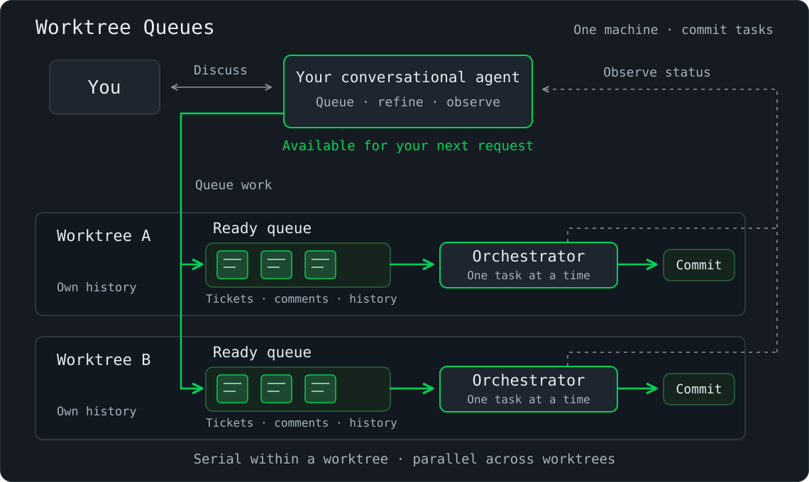
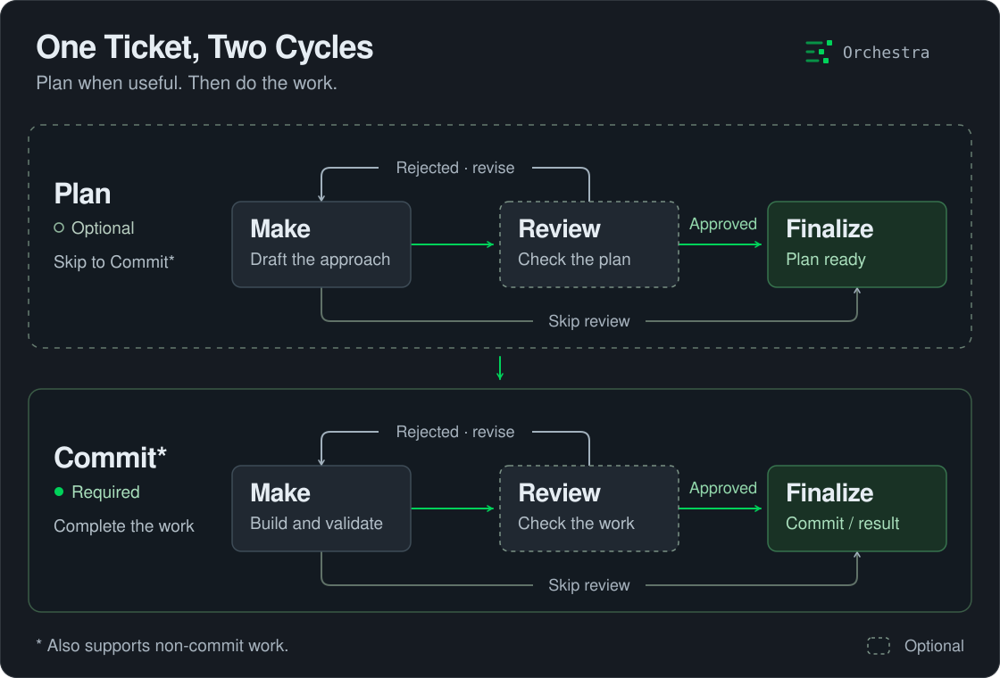
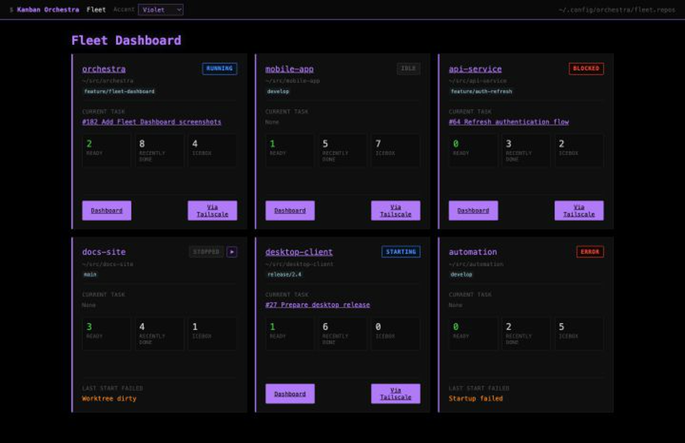
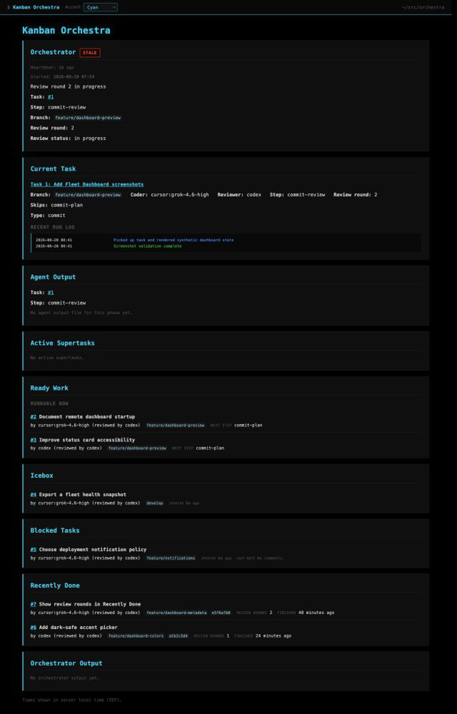
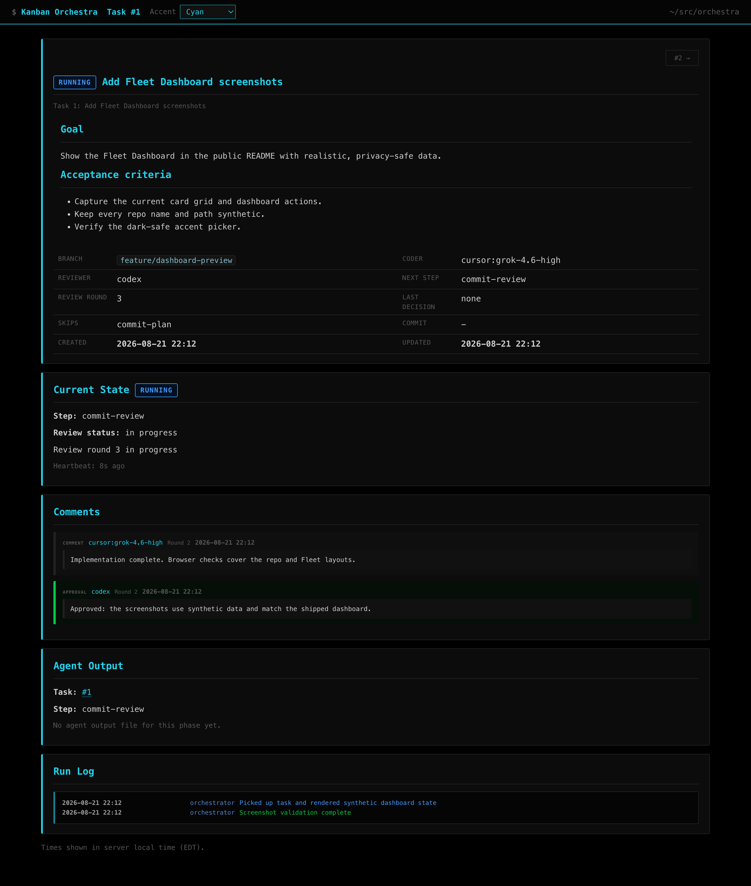

<p align="center">
  
</p>

**Durable task queues, one per worktree, so your conversational agent stays available.**

Orchestra gives each worktree on your machine its own durable queue of coding
tickets. You describe work to your main conversational agent; it queues the
ticket and observes progress, then stays available for the next conversation
instead of being tied up implementing. Behind each queue, one worker executes
tickets serially: it assigns the AI coding CLIs already installed on your
machine to plan, build, and review each one, records the complete decision
trail, and lands the approved commit in your repo.

The machine remains the execution boundary. Git state, task history, agent
processes, credentials, and builds stay local. Tailscale makes the dashboards
available over tailnet-only HTTPS, so the same single-developer workflow works
from your desk, phone, or iPad without turning Orchestra into a hosted or
multi-user service.

<p align="center">
  
</p>

## Status

Orchestra is maintained personal tooling, used in real development workflows.
It is still evolving: agent CLI integrations, configuration formats, and
defaults change as the underlying tools do, so an update can mean adjusting
local settings. To try it without touching a real project, start with
[Your First Orchestra Task](docs/first-task.md).

## The Point

The queues are the point. Each worktree has a ready funnel: you and your
conversational agent drop well-specified tickets into it, and a single worker
carries them, one at a time, through a coherent lifecycle. The conversational
agent queues, refines, and observes; it does not do the queued implementation,
so it remains free to talk, plan, and queue more. Orchestra is designed for a
single developer and is deliberately not a team issue tracker, distributed
worker system, or cloud build service.

A normal commit task has two peer cycles: **Plan** and **Commit-Make**.
Each can review, reject, and revise its candidate; Commit-Make also includes
finalization.

<p align="center">
  
</p>

Dashed outlines mark optional groups and steps. Plan review rejects back to
the planner; commit review rejects back to the same sticky coder. An approved
plan advances to Commit-Make. An approved change advances to finalization
inside Commit-Make, where the actual git commit is created.

- **Plan** is entirely optional, including **drafting** and **plan review**.
  Normal tasks skip planning by default; enable it when implementation deserves
  a reviewed approach before files change. A drafted plan can also skip review.
- **Commit-Make** is required and includes **implementation**, optional
  **commit review**, and **finalization**. The coder builds or reworks the staged
  candidate and records validation evidence and the proposed commit message.
  When review is enabled, a separate reviewer inspects the staged diff;
  rejection returns to the same coder for rework. Approval or skipping review
  proceeds to finalization by that coder, producing one commit.
- Reviewer infrastructure failures are not content rejections. Orchestra
  retries them without spending a review round, then blocks with the candidate
  preserved if the reviewer remains unavailable.

Each worktree's queue runs one task at a time, so agents cannot trample one
another in the same worktree; there is no concurrent execution within a
worktree. For parallel work, use several worktrees: Fleet runs their queues
side by side on the same machine.

## How You Use It

The primary interface is your AI agent's **Kanban skill**, not a CLI you need
to operate by hand. In a work repo, ask your agent for what you want:

> "Using the Kanban skill, queue a task to fix the broken pagination query."

The skill turns that request into a durable Markdown ticket, lets you refine it
in `none`, and moves it to `ready` when it is coherent. The orchestrator then
owns normal workflow transitions. You step back in when a task needs a product
decision, missing context, or an explicit recovery choice.

The task database and durable comments keep the ticket, plan, validation,
review decisions, run history, and landed commit tied together. A coding-agent
session can end without losing the workflow.

### Task Types

The normal unit is a **commit task**: one coherent ticket, one eventual landed
commit. Orchestra also supports narrower advanced workflows:

- **Pull request tasks** manage a PR and its review without landing commits.
- **Other tasks** perform non-standard or operational work and leave durable
  completion evidence instead of requiring a commit or PR.
- **Supertasks** let a planner derive and sequence the commit-sized child tasks
  needed for a larger outcome; the supertask itself never lands a commit.

## One Machine, From Anywhere

Remote use preserves the same operating model. Orchestra and every coding CLI
continue to run on one developer-controlled machine. Tailscale only extends the
control surface:

- dashboard startup brings localhost online first
- it then makes a best-effort attempt to publish an exact Tailscale Serve HTTPS
  mapping
- existing mappings are reused and unrelated Serve routes are left untouched
- Tailscale absence or failure never blocks localhost
- Funnel is not enabled; remote dashboards remain tailnet-only

Use the exact URL printed by `ko-get-update`, `ko-fleet status`, or dashboard
startup. Orchestra prefers the live Tailscale URL when an exact mapping exists
and otherwise falls back to localhost. Dashboard hostnames and ports are
runtime state, not configuration to hard-code.

From a remote Codex or Claude session that reaches the machine, you can queue a
ticket in plain language. From the Fleet Dashboard, you can watch every repo,
open its dashboard, and start an eligible stopped instance. The result is the
same single-developer workflow whether you are sitting at the Mac or checking
in from an iPhone or iPad.

## Dashboards

### Fleet Dashboard

The Fleet Dashboard turns every repo in your private fleet config into a status
card. Each card shows its path, branch, runtime state, current task, Ready,
Recently Done, and Icebox counts, plus its Dashboard action and any known
startup failure. An eligible stopped repo gets a play action that uses the same
validation and startup path as `ko-fleet start <repo>`.

<p align="center">
  
</p>

Repo dashboards open in a new tab so the Fleet view stays put. A Fleet view
reached through Tailscale links cards to their exact Tailscale mappings; a
local Fleet view links cards to localhost.

### Repo Dashboard

The repo dashboard exposes the active task, queues, recent completions,
review-round count, durable comments, and run history. The task-detail view
keeps the goal, acceptance criteria, orchestration state, review evidence, and
logs together. Its heading identifies `(short computer name | short instance
name)`. Supported task actions include queueing ready work and continuing
review-cap blocks.

When a live Fleet Dashboard is discoverable, repo overview and task-detail
pages show a compact **Fleet Dashboard** action in the top bar. It uses the
preferred Tailscale-or-local URL and returns to Fleet in the same tab.

<table>
  <tr>
    <th width="50%">Repo overview</th>
    <th width="50%">Task detail</th>
  </tr>
  <tr>
    <td></td>
    <td></td>
  </tr>
</table>

## Getting Started

The quickest way to see Orchestra work is
[Your First Orchestra Task](docs/first-task.md): a throwaway repo, one agent
CLI, and one small task from queue to landed commit. The steps below cover a
regular installation.

### Prerequisites

- Python 3.10+
- Git
- macOS or Linux (Windows is untested)
- at least one supported coding-agent CLI installed and authenticated
- Tailscale when remote dashboard access is desired

The built-in role defaults use both Claude Code and Codex. With only one of
them installed, point every role at that CLI; see
[Agent Configuration](#agent-configuration) or the first-task guide.

### Install Orchestra

1. Clone the repo:

   ```bash
   git clone https://github.com/confusionstudios/orchestra.git /path/to/orchestra
   ```

2. Point `ORCHESTRA_DIR` at that checkout in `.zshrc`, `.bashrc`, or the
   equivalent:

   ```bash
   export ORCHESTRA_DIR="/path/to/orchestra"
   ```

3. Bootstrap the checkout-local Python environment and install the shared
   skills:

   ```bash
   "$ORCHESTRA_DIR/shared_scripts/bootstrap-python-env.sh"
   "$ORCHESTRA_DIR/bin/ko-install-global-skills"
   ```

   The skill installer writes thin user-level wrappers for Claude, Codex, Kilo,
   and Antigravity. Those wrappers read their canonical instructions from
   `$ORCHESTRA_DIR/AI-skills`, so edits to an existing skill take effect
   immediately. Re-run the installer after adding, deleting, or renaming a
   skill; use `--check` to detect wrapper drift without writing.

4. Optionally load the zsh helpers:

   ```zsh
   source "$ORCHESTRA_DIR/shell/orchestra.zsh"
   ```

### Start One Repo

Run the instance from the root of the work repo it should own:

```bash
cd /path/to/work-repo
"$ORCHESTRA_DIR/bin/ko-orchestrator"
```

The launch directory is the instance identity. That process owns the repo's
task queue, runs one task at a time, and starts the matching dashboard. Keep it
alive in a dedicated terminal or another local process supervisor.

From another terminal—or through the Kanban skill—check it with:

```bash
"$ORCHESTRA_DIR/bin/ko-get-update"
```

With the optional zsh helpers, `ko-start`, `ko-status`, and `ko-dashboard` run
those same current-repo operations.

### Start A Fleet

Fleet is still single-machine operation; it simply manages one Orchestra
instance per configured repo:

```bash
"$ORCHESTRA_DIR/bin/ko-fleet" init
"$ORCHESTRA_DIR/bin/ko-fleet" add /path/to/work-repo
"$ORCHESTRA_DIR/bin/ko-fleet" precheck
"$ORCHESTRA_DIR/bin/ko-fleet" start
"$ORCHESTRA_DIR/bin/ko-fleet" dashboard
```

The private config at `~/.config/orchestra/fleet.repos` contains one repo root
per line; blank lines and `#` comments are allowed. Fleet provides `status`,
`start`, `stop`, `stop-all`, `restart`, `attach`, and `logs`, plus:

```bash
"$ORCHESTRA_DIR/bin/ko-fleet" dashboard
"$ORCHESTRA_DIR/bin/ko-fleet" dashboard <repo>
"$ORCHESTRA_DIR/bin/ko-fleet" dashboard-open <repo>
```

Dashboard commands prefer the exact Tailscale URL. Pass `--local` when you
specifically want localhost for debugging.

## Upgrading An Existing Installation

See [Agent Configuration Upgrade](docs/agent-configuration-upgrade.md) for
pulling an update, restarting instances, optional local preferences, shell-default
migration, and model discovery. Existing shell defaults continue to work;
ignored preferences and caches do not travel with Git.

## Agent Configuration

Orchestra shells out to local agent CLIs. The registry supports named agents
and dynamic provider/model specs:

| Key or syntax | Agent CLI | Notes |
|---|---|---|
| `haiku`, `sonnet`, `opus`, `fable`, `claude` | Claude Code | Product fallbacks: `sonnet` for coder/planner; `opus` for supertask planner |
| `codex` | OpenAI Codex CLI | Product fallback for reviewer, plan reviewer, and supertask reviewer |
| `antigravity` | Antigravity (`agy`) | Runs through its non-interactive print mode |
| `cursor:<model>` | Cursor Agent via GUI relay | Routes through `remote-control-cursor run` and passes the exact model string to Cursor; `grok` has a tracked baseline target; use `ko-task agents` to inspect its effective model |
| `kilo:<model>` | Kilo Code | Passes the exact model string to Kilo; `kilo` uses its auto/free model |
| `codex:<model>`, `claude:<model>`, `antigravity:<model>` | Respective CLIs | Use the provider's normal invocation flags with the supplied model ID |

`shared_scripts/agent_registry.yaml` is the source of truth for built-in keys,
aliases, display labels, and command templates. Orchestra does not provide API
keys, accounts, or model billing.

An installation can set aliases and role defaults for all its work repositories in
`$ORCHESTRA_DIR/shared_scripts/agents.local.yaml` (ignored by Git):

```yaml
version: 1
aliases:
  grok: cursor:grok-4.7-high
defaults:
  coder: {agent: grok}
  planner: {agent: codex}
```

This shared file accepts `version`, `aliases`, and `defaults`. It overrides the
product baseline; work-repository aliases, agents, and role entries take
precedence over it. A repo role entry replaces that shared role entry in full.
An environment setting such as `ORCHESTRA_DEFAULT_CODER=grok` keeps selecting
`grok` and uses its effective target. Editing the shared file does not require
a commit or shell-configuration change. Restart workers and dashboards after
editing it; saved task commands remain fixed. The file is local to the Orchestra
installation and is not distributed by Git. `ko-task agents` shows its path and
reports each alias and role's source. Shared defaults can replace persistent
`ORCHESTRA_DEFAULT_*` shell exports; remove those exports to use file-based
defaults. Existing shells and workers retain inherited environment settings
until restarted.

To copy literal role exports from `~/.zshrc` into shared preferences, preview:

```bash
"$ORCHESTRA_DIR/bin/ko-migrate-agent-defaults"
# Save the proposed settings explicitly:
"$ORCHESTRA_DIR/bin/ko-migrate-agent-defaults" --write
```

The helper reads the shell file as text and never executes or modifies it.
It preserves existing aliases and other roles, refuses conflicting defaults
(including existing model/reasoning patches), and rejects dynamic or ambiguous
role declarations or carriage-return line endings. Files containing comments or `#` text require manual editing
when migration would change them, so rewriting cannot discard annotations.
It reads literal declarations, not evaluated shell state;
conditional logic and sourced files require manual inspection. `--zshrc <path>`
and `--config <path>` select alternate files. Repeated writes are idempotent.
Shell exports continue to take precedence until optionally removed manually
and cleared from the launch environment. Restart workers and dashboards after
writing preferences. The helper does not change alias targets or refresh models.

Each work repository can add `.kanban-orchestra/agents.yaml` (ignored by Git):

```yaml
version: 1
agents:
  codex: {model: gpt-6.1-sol, reasoning: high}
  quick: {provider: cursor, model: composer-next, options: {--trust: false}}
aliases: {my-reviewer: codex}
defaults:
  coder: {agent: codex, model: gpt-6.1-sol}
  reviewer: {agent: my-reviewer}
```

`agents` patches a built-in entry by name. Omitted fields, provider flags, and
options remain. A new entry needs `provider` and `model`; switching provider
uses that provider's template. `reasoning: null` removes inherited Codex
reasoning. In `options`, `true` adds a flag, a string supplies a value, and
`false` or `null` removes it. Unknown fields, providers, aliases, and cycles
are errors. Model IDs are passed as literal CLI arguments; the CLI decides
whether they exist.

Precedence is explicit task agent, then an explicit `ORCHESTRA_DEFAULT_*`
environment agent, then the repo role entry, then the shared role entry, then
the product fallback.
An explicit task or environment choice suppresses that role's configured model,
reasoning, and options. Local agent and alias entries override same-named
product entries. `ko-task agents` shows effective commands and their sources.
New tasks save the selected commands; edits to `agents.yaml` affect new tasks
after restarting the worker and dashboard, and do not retarget queued work.
`ko-task set --coder-agent` and `--reviewer-agent` explicitly replace the
respective saved choice for later steps. Existing tasks receive a snapshot at
their next dispatch. Each work repository has its own configuration.

Run `ko-task models refresh [provider]` to discover installed CLI models on
demand. `ko-task models status` shows freshness, last successful refresh, and
failure reasons; `ko-task models list [provider]` merges discovered models
with tracked baseline choices. The generated, Git-ignored
`.kanban-orchestra/model-cache.json` is scoped to this work repository and a
nonsecret hash of the local user, configuration, and authentication context.
Its version 1 `providers` entries store `scope`, `models` (exact `id`, `label`,
and `capabilities`), `state`, `reason`, `last_attempt`, and `last_success`.
Failed refreshes retain the last good list. Missing or corrupt cache data
falls back to baseline choices; refresh to recover. The cache never changes
local preferences or limits explicit `provider:model` IDs. Cached listings reflect refreshes immediately;
active task selections remain fixed.

Default roles can be changed without editing the registry:

```bash
export ORCHESTRA_DEFAULT_CODER=sonnet
export ORCHESTRA_DEFAULT_REVIEWER=codex
export ORCHESTRA_DEFAULT_PLANNER=sonnet
export ORCHESTRA_DEFAULT_PLAN_REVIEWER=codex
export ORCHESTRA_DEFAULT_SUPER_PLANNER=opus
export ORCHESTRA_DEFAULT_SUPER_REVIEWER=codex
export ORCHESTRA_DEFAULT_UNBLOCKER=sonnet
```

Smoke-test the configured agents with:

```bash
"$ORCHESTRA_DIR/bin/ko-agent-smoke"
```

Reports remain local under `.kanban-orchestra/agent-smoke/`.

## Operating Model

Kanban state belongs to the launched work repo:

- `kanban-orchestra.db` — durable SQLite task state
- `kanban-orchestra.sql` — portable database dump
- `.kanban-orchestra/` — runtime metadata, transcripts, and logs
- `kanban-orchestra.lock` — repo-scoped orchestrator ownership

These files are local runtime state and belong in the work repo's
`.gitignore`; coders stage with `git add .`, so unignored runtime files can end
up in a commit. `"$ORCHESTRA_DIR/bin/ko-kanban"` appends most of them when it
first creates the database; you can also add them yourself as in the
[first-task guide](docs/first-task.md#2-create-a-throwaway-repo).

`ORCHESTRA_DIR` supplies the shared tools; it may point at the same checkout
when Orchestra works on itself.

The orchestrator expects exclusive access to the worktree while executing. It
can launch while dirty, keeps its dashboard and heartbeat available in
`waiting-dirty`, and automatically begins eligible queued work once the tree is
clean. Tasks may be queued while it waits. Startup recovery is also deferred so
tracked, staged, and untracked changes and interrupted-task metadata remain
untouched. An uninterrupted active task may carry its own edits through review,
rework, and finalization. Tasks on `master` or `main` are disabled by default;
a repo must opt in with a standalone `ALLOW_TASKS_ON_MASTER` line in its root
`AGENTS.md`.

Useful operator rules:

- Keep a ticket in `none` while refining it; set it to `ready` when it is
  coherent and should run.
- The agent operating the Kanban skill should manage task state, not edit the
  worktree beside the orchestrator.
- Use `ko-task continue` for structured recovery. Review-cap blocks require
  `--add-review-rounds N`; other blocks require the recorded or explicit next
  step.
- A running orchestrator reassesses blocked tasks with the configured unblocker
  and either resumes a safely recoverable task or leaves a durable explanation.

## Security

Orchestra runs coding agents in non-interactive YOLO-style modes as your local
user. It is not a sandbox or permission boundary. A prompt-injected or
misbehaving agent can reach files, credentials, browser state, and repositories
available to that account.

Run Orchestra and its coding CLIs under a dedicated macOS user, container, or
another boundary appropriate to your risk. Tailscale limits who can reach the
dashboard; it does not limit what a local agent process can do. See
[SECURITY.md](SECURITY.md) for the threat model and deployment guidance.

## Source Layout

| Path | Contents |
|---|---|
| `AI-skills/` | Canonical Kanban and ad-hoc agent instructions |
| `kanban-orchestra/scripts/` | Task database, orchestrator, dashboards, Fleet, and CLI implementation |
| `kanban-orchestra/prompts/` | Prompts injected into task agents |
| `bin/` | Thin wrappers using the checkout-local Python environment |
| `shared_scripts/` | Agent registry, setup, installation, and helper scripts |
| `tasks/kanban-orchestra-spec.md` | Canonical workflow and state-machine specification |

## Development

There is no build step. Bootstrap the local environment and run the test suite:

```bash
export ORCHESTRA_DIR="/path/to/orchestra"
"$ORCHESTRA_DIR/shared_scripts/bootstrap-python-env.sh"
"$ORCHESTRA_DIR/bin/ko-test"
```

When Orchestra is working on its own checkout, restart the running repo or
Fleet instance after code changes. Long-lived Python processes continue using
the code they loaded at startup.

## Feedback

The most useful contribution is using Orchestra on real work and saying where
it got confusing, got stuck, or could work better. See
[CONTRIBUTING.md](CONTRIBUTING.md) for what to include in a report.

## License

MIT. See [LICENSE](LICENSE).
